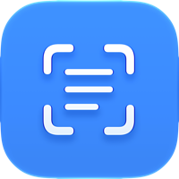

  
  <h1>Snaptext</h1>
  
<b>Grab text from anywhere on your screen — instantly.</b>

  
A tiny macOS menu bar app that captures any region of your screen and copies the recognized text straight to your clipboard, using Apple's built-in on-device OCR.

---

## Features

- **⌘⇧2 anywhere** — press the global shortcut in any app to start a crop selection.
- **Instant OCR** — text is recognized with Apple's Vision framework (on-device, private, no network) and copied to your clipboard immediately.
- **Native crop UI** — uses the built-in macOS screen-capture crosshair; multi-monitor and Retina aware.
- **Lives in the menu bar** — no Dock icon, no clutter. A quick toast shows what was copied.
- **Customizable shortcut** — click to record any key combination; it's captured exclusively so other apps don't also fire it.
- **Universal binary** — runs natively on Apple Silicon and Intel Macs.

## Install

1. Download **`Snaptext.dmg`** from the [latest release](https://github.com/kartikk-k/Snaptext-mac/releases/latest).
2. Open the DMG and drag **Snaptext** into **Applications**.
3. Launch Snaptext from Applications. It appears in your menu bar (look for the text-scan icon).

On first launch, Snaptext opens a small window asking for two permissions:

| Permission | Why |
| --- | --- |
| **Accessibility** | Lets the global ⌘⇧2 shortcut work system-wide (and be captured exclusively). |
| **Screen Recording** | Lets Snaptext capture the region you select. |

Click **Allow** on each and grant them in System Settings. Then press **⌘⇧2** anywhere to capture text.

## Usage

- Press **⌘⇧2** (or click **Capture Text** in the menu bar).
- Drag to select the region containing text.
- The recognized text is copied to your clipboard and shown briefly in a toast at the bottom of the screen.
- Change the shortcut anytime from the menu bar → **Shortcut** tab → click the field and press a new combination.

## Requirements

- macOS (recent versions).
- Apple Silicon or Intel — the release is a universal binary.

## Building from source

Open `Snaptext.xcodeproj` in Xcode and run the **Snaptext** scheme. It's a plain AppKit app — no third-party dependencies. All OCR and screen capture use built-in macOS frameworks (Vision + `screencapture`).

## Privacy

Everything runs locally on your Mac. Snaptext never sends your screen or text anywhere — OCR happens on-device via Apple's Vision framework, and recognized text goes only to your clipboard.

## License

MIT
